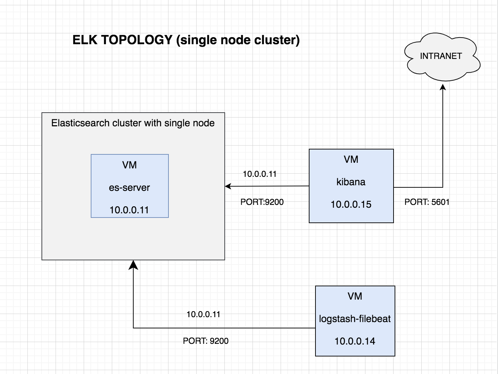
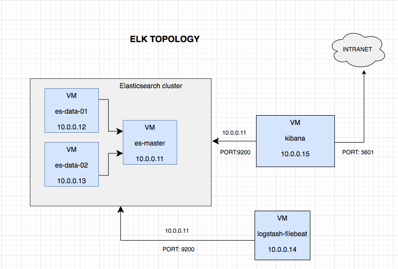

# elastic-vagrant-stack
#### Elastic stack with single node elastic cluster in a single  VM


#### Elastic stack with 3 node elastic cluster in three differnet VMS


## vagrant commands

Status of each vagrant machine forming the Elastic stack topology can be checked using

```bash
vagrant status
```
To create and provision the topology use below command
```bash
vagrant up
```

Advisable to run `vagrant status` again to check and ensure all the vagrant machines are running.

Automatically elasticsearch cluster,kibana,logstash and filebeat will be configured and pipeline will be build for ready to use.

Port forward is configured and Elasticsearch can be accessed from localhost using 
```bash
127.0.0.1:9200
```
Port forward is configured and kibana can be access from localhost using 
```bash
127.0.0.1:5601
```


Insteasd if each vm has to be created and provisioned independently, below commands can be used for each of them:

```bash
example :vagrant up esmaster
```

To ssh into any of the machine use 
```bash
vagrant ssh "machine-name"
example : vagrant ssh esmaster
```

To stop all the vagrant machine (or specify specific vagrant machine)
```
vagrant halt
```

To stop and deletes all traces of all the vagrant machine (or specify specific vagrant machine)
```
vagrant destroy
```

Below command watches all local directories of any rsync synced folders and automatically initiates an rsync transfer when changes are detected
```
vagrant rsync-auto
```

Environment variable `CLUSTER_TYPE` can be used to create single or multi node cluster. `CLUSTER_TYPE= 'multi'` will spin up the Elasticsearch cluster with 1 master node and 2 data nodes, each in separate vagrant machines. 

---
**NOTE** 
kibana vagrant machine is allocated 2 gb memory and 2 cpu.
ES master node is allocated 1 gb memory

---


